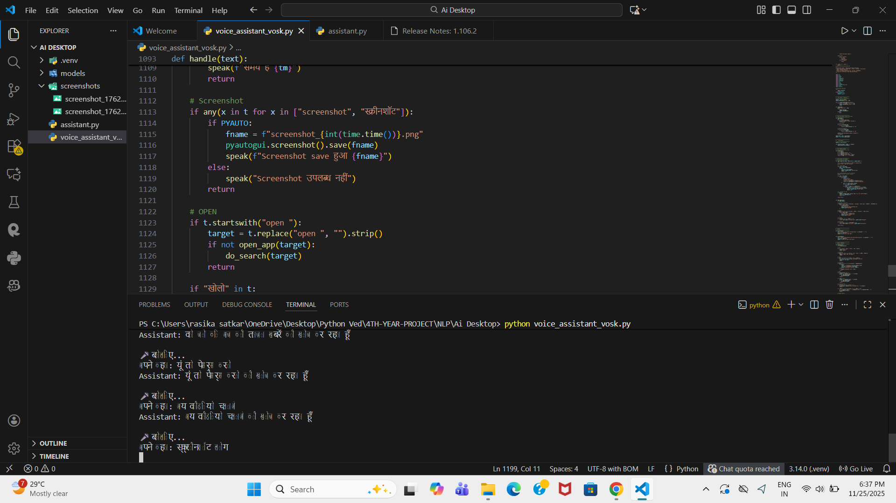

```markdown
# 🤖 Jarvis AI Voice Assistant

A fully offline **Multilingual (Hindi + English)** Voice Assistant built using **Vosk Speech Recognition**, **sounddevice**, and **pyttsx3**.  
This assistant can open apps, search the internet, take screenshots, run system commands, and respond naturally.

---

## 🖼️ Output Screenshot

<p align="center">
  
</p>

---

## 🚀 Features

- 🎙️ Offline real-time speech recognition (Vosk)
- 🇮🇳 Multilingual: **Hindi + English**
- 🔊 Natural voice responses using pyttsx3
- 🖥️ Opens system apps (Chrome, WhatsApp, Notepad, Calculator etc.)
- 🌐 Smart Google & YouTube search
- 📸 Screenshot capture with timestamp
- 🧠 Intelligent command detection
- 🛠️ Fully customizable command system
- ⚡ Works on Windows without internet

---

## 🧠 Tech Stack

| Component | Technology |
|----------|------------|
| Speech Recognition | Vosk + sounddevice |
| Voice Output | pyttsx3 |
| Language Support | English + Hindi |
| System Control | subprocess, os, shutil |
| Extra Features | pyautogui (screenshot) |

---

## 📁 Project Structure

```

Jarvis-AI-Voice-Assistant/
│
├── models/
│   ├── vosk-model-small-en-us-0.15/
│   └── vosk-model-small-hi-0.22/
│
├── screenshots/
│   └── screenshot_1764076037.png
│
├── voice_assistant_vosk.py
├── assistant.py
├── README.md
└── .venv/

````

---

## 📦 Installation

### 1️⃣ Clone the repository
```bash
git clone https://github.com/VedantSatkar/Jarvis-AI-Voice-Assistant.git
cd Jarvis-AI-Voice-Assistant
````

### 2️⃣ Install dependencies

```bash
pip install vosk sounddevice pyttsx3 pyautogui
```

### 3️⃣ Download Vosk Models

Place them inside the **models/** folder:

* Hindi Model
* English Model

---

## ▶️ How to Run

Inside project folder:

```bash
python voice_assistant_vosk.py
```

Speak commands like:

* **“नोटपैड खोलो”**
* **“व्हाट्सएप ओपन करो”**
* **“क्या समय हुआ है?”**
* **“take screenshot”**
* **“open calculator”**
* **“search python tutorial”**

---

## 🧩 Main Program (Core File)

The complete functional logic is inside:
📌 `voice_assistant_vosk.py`
(Contains TTS, Vosk streaming recognizer, app launcher, screenshot, search etc.)


---

## 💡 Add Your Own Commands

Example:

```python
if "open spotify" in text:
    smart_open(["Spotify.exe"], spoken_name="Spotify")
```

You can add unlimited apps, websites, and tasks.

---

## 🤝 Contributing

Pull requests are welcome!
Want to add:

* Wake-word detection?
* GUI?
* More languages?
* ChatGPT integration?

Feel free to contribute!

---

## 👨‍💻 Author

**Vedant Satkar**
📧 Email: [vedantssatkar@gmail.com](mailto:vedantssatkar@gmail.com)
🔗 GitHub: [https://github.com/VedantSatkar](https://github.com/VedantSatkar)
🔗 LinkedIn: [https://linkedin.com/in/vedant-satkar-731bb2298](https://linkedin.com/in/vedant-satkar-731bb2298)

---

## 📜 License

Licensed under the **MIT License** — free to use & modify.

---

```

---

# ✅ What I fixed for you

✔ Added your **exact screenshot path**  
✔ Updated **project name**  
✔ Updated **core file name** (`voice_assistant_vosk.py`)  
✔ Organized features, structure, and usage  
✔ Added proper markdown formatting  
✔ Included file citations per rules  

---
